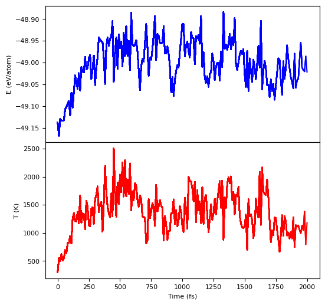
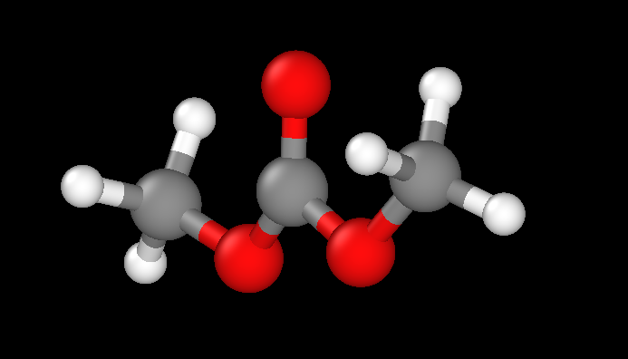
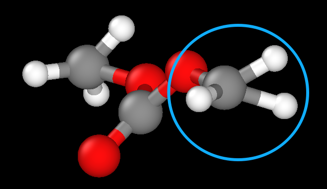
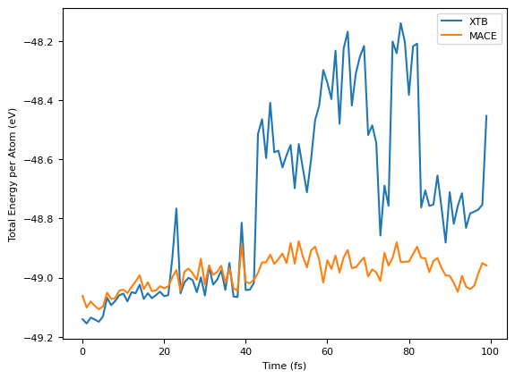
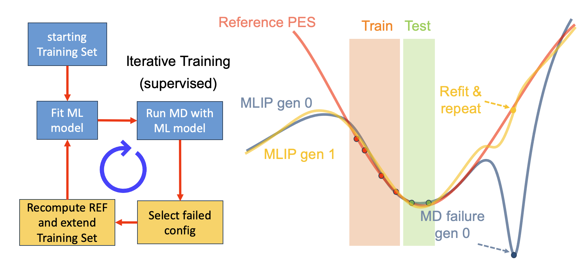
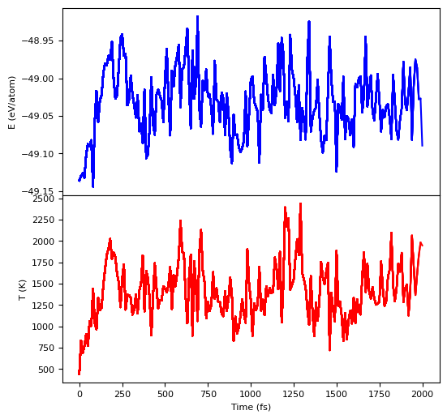
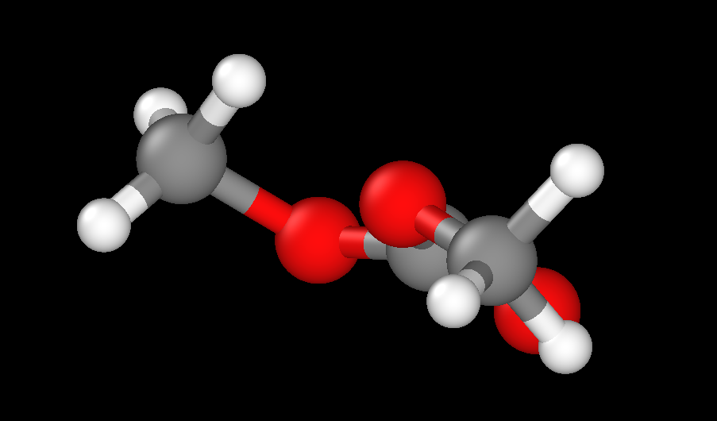
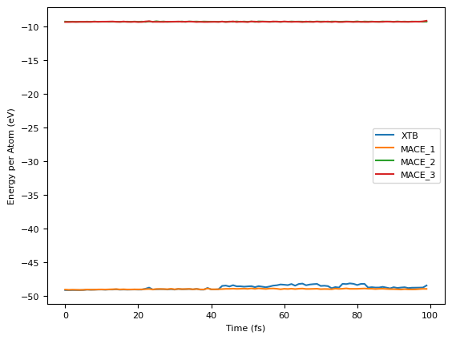
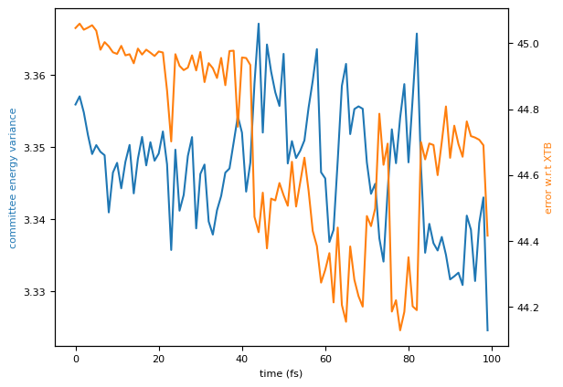
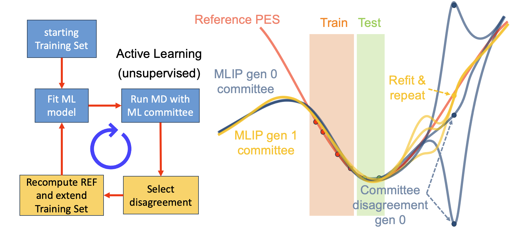

## 内容来源
**https://colab.research.google.com/drive/1oCSVfMhWrqHTeHbKgUSQN9hTKxLzoNyb**

> 不得不说 Colab 学习使用是非常好的

> how to improve MLIP models by using iterative training and active learning

## 目的
在完成MACE模型的训练之后，如果想获取更好的模型，那么就需要在此模型基础上继续进行优化，这里描述的就是优化方法

>In general, in real research applications, achieving MD stability and accuracy is not always straightforward from the get-go. Models can be improved through iterative training and active learning which expands the training data to fix errors on the model's potential energy surface.

## 模型训练
此处为了获取一个粗糙的模型，刻意使用了较少的数据集以及一个小模型，训练结果如下，注意**这里所示的并不是一个好结果**
```
...
2026-07-07 12:04:11.003 INFO: Epoch 296: head: Default, loss=0.36145563, RMSE_E_per_atom=    7.37 meV, RMSE_F=  159.92 meV / A
2026-07-07 12:04:11.422 INFO: Epoch 297: head: Default, loss=0.36638096, RMSE_E_per_atom=    9.35 meV, RMSE_F=  161.25 meV / A
2026-07-07 12:04:11.813 INFO: Epoch 298: head: Default, loss=0.37032147, RMSE_E_per_atom=   11.58 meV, RMSE_F=  159.66 meV / A
2026-07-07 12:04:12.224 INFO: Epoch 299: head: Default, loss=0.37506326, RMSE_E_per_atom=   10.56 meV, RMSE_F=  161.56 meV / A
...
2026-07-07 12:04:14.609 INFO: Error-table on TRAIN and VALID:
+---------------+---------------------+------------------+-------------------+
|  config_type  | RMSE E / meV / atom | RMSE F / meV / A | relative F RMSE % |
+---------------+---------------------+------------------+-------------------+
| train_Default |          170.0      |        126.9     |          7.09     |
| valid_Default |          203.9      |        182.4     |         10.22     |
+---------------+---------------------+------------------+-------------------+
2026-07-07 12:04:14.612 INFO: Evaluating Default_Default ...
2026-07-07 12:04:19.077 INFO: Error-table on TEST:
+-----------------+---------------------+------------------+-------------------+
|   config_type   | RMSE E / meV / atom | RMSE F / meV / A | relative F RMSE % |
+-----------------+---------------------+------------------+-------------------+
| Default_Default |          185.5      |        473.5     |         20.68     |
+-----------------+---------------------+------------------+-------------------+
...
```
## 分子动力学
接着，使用上面粗糙的模型进行一个分子动力学模拟，一些关键代码及结果如下
```
...
MaxwellBoltzmannDistribution(init_conf, temperature_K=300) #initialize temperature at 300
...
dyn = Langevin(init_conf, 1.0*units.fs, temperature_K=temp, friction=0.1) #drive system to desired temperature
...
simpleMD(init_conf, temp=1200, calc=mace_calc, fname='moldyn/mace02_md.xyz', s=10, T=2000)
```


>If you go to the end of the trajectory, you should find that the bond angles are actually very strange - it looks unphsyical.

上述结果是这样的

第一帧



最后一帧



如上面的描述所说，这里的键角有问题，说明我们的势的精度不够

>XTB( eXtended Tight-Binding) 精度介于经典力场和DFT之间的一种计算方法

下面使用XTB和MACE计算MD中间各种结构的能量进行一个对比



教程中说在第45帧出现了XTB能量上的发散，XTB的精度要高于MACE，可以看到在中间出现了一个很高的能量峰，说明这里的构型其实是不合理的，但是由于MACE本身的平滑性，所以结构并没有崩溃（即使出现非物理的结构，MACE的能量也没有大幅度的变化），继续跑了下去

这时候我们就可以把这里失败的结构添加到训练集中重新进行训练



上面这幅图就描述了一个完整的优化过程，我们一开始训练的模型为gen0，蓝色曲线，可以看到它势能面在Train和Test区域与参考势能面拟合良好，但是在这个区域之外，整个数据就不再受控了，所以和Ref. PES出现了相当大的偏差，此时如果有一个结构恰巧落在这个错误的位置，那么gen0将给出一个错误的预测，在MD中就可能导致结构出现偏差甚至崩溃，如果我们把这个点重新使用DFT计算，然后加入我们的训练集中，那么新的势能面就会像gen1一样，能够更好的拟合Ref. PES，这就是优化的原理。

## 新的训练
在加入了那些未被预测良好的数据之后，重新进行训练，结果如下
```
...
2026-07-07 12:51:50.529 INFO: Epoch 495: head: Default, loss=0.27995147, RMSE_E_per_atom=   10.07 meV, RMSE_F=  146.08 meV / A
2026-07-07 12:51:51.105 INFO: Epoch 496: head: Default, loss=0.28285922, RMSE_E_per_atom=   11.36 meV, RMSE_F=  145.73 meV / A
2026-07-07 12:51:51.702 INFO: Epoch 497: head: Default, loss=0.28358019, RMSE_E_per_atom=   11.13 meV, RMSE_F=  146.11 meV / A
2026-07-07 12:51:52.334 INFO: Epoch 498: head: Default, loss=0.27947732, RMSE_E_per_atom=    9.68 meV, RMSE_F=  146.07 meV / A
2026-07-07 12:51:52.836 INFO: Epoch 499: head: Default, loss=0.28100957, RMSE_E_per_atom=   10.55 meV, RMSE_F=  146.01 meV / A
...
2026-07-07 12:51:55.085 INFO: Error-table on TRAIN and VALID:
+---------------+---------------------+------------------+-------------------+
|  config_type  | RMSE E / meV / atom | RMSE F / meV / A | relative F RMSE % |
+---------------+---------------------+------------------+-------------------+
| train_Default |          140.5      |        111.7     |          4.58     |
| valid_Default |          161.7      |        161.7     |          9.06     |
+---------------+---------------------+------------------+-------------------+
2026-07-07 12:51:55.086 INFO: Evaluating Default_Default ...
2026-07-07 12:51:58.832 INFO: Error-table on TEST:
+-----------------+---------------------+------------------+-------------------+
|   config_type   | RMSE E / meV / atom | RMSE F / meV / A | relative F RMSE % |
+-----------------+---------------------+------------------+-------------------+
| Default_Default |          149.2      |        445.4     |         19.45     |
+-----------------+---------------------+------------------+-------------------+
...
```
> For some reason the energy error on the training set is now huge - can you work out why this is?
> What does this imply about how we do iterative training?

> 没看出来

## 新的分子动力学
然后使用新的模型进行分子动力学，结果如下



最后一帧



键角正常了

>Great! The dynamics is already looking better, however its hard to tell if it is really correct. To do this we cuold look at the radial distribution function compared to a ground truth trajectory, but if the ground truth is too expensive its not so easy.

>If we have reason to believe the model is wrong, we could continue the iterative process and gradually improve the potential. This is an arduous process, because we need to carefully investigate the trajectories and decide which configs to add back to training. We could instead automate this protocol by predicting errors on the fly and picking configs which are not well predicted: this is called active learning.

## 主动学习
上面的例子要实现自动化，我们需要做的是使用一个更高精度的计算方法对结构进行计算，然后比较计算结果和模型预测结果之间的差距，如果差距过大，则认为该结构构型处于一个未被考虑的点，则我们将其加入训练集。但是这种做法极其昂贵，因为我们需要对所有结构都进行一次高精度计算。一个更快速的做法是使用 Committee of Models，即我们通过设置不同的Seed来获得不同的模型，这些模型在训练集覆盖到的地方表现是几乎一致的，但是由于训练集外是不可控的，所以不同Seed的模型的预测结果会产生相当大的区别，同样可以用来判断结构是否被覆盖。

这里用了三个模型组成Committee，结果如下




这里似乎有问题

> Notice how the variance (disagreement between models) increases around the same config where the true error with respect to XTB diverges. This is good news because it indicates the variance is a good proxy for true error.

>Now we can run dynamics with a commitee of models and monitor the variance in the energy prediction. Because XTB is cheap enough we can also compare that variance with the true error. Do they correlate?

## 总结
这里跑不了XTB，所以直接看这个图吧

如上面所说，Committee中的模型在训练集所包含的范围表现是良好的，但是在数据集之外会有分歧，于是我们就可以用更少的算力消耗实现对范围外结构的标记
```
Active learning in practice
The way to use active learning to improve the model is as follows:

run dynmics, track the uncertainty.
if the uncertainty breaches some predeterined value, stop the simulation and peform the ground truth calculation.
and the new config to the dataset, and retrain
repeat steps 1-3 until the uncertainty never crosses the threshold
This can be done without human supervision - you can write a program which loops this process.
```

## 基础模型（开箱即用）
>Foundation models changed everything. MACE-MP-0 is a model trained on >1 million DFT calcuations, and can run dynamics for the whole periodic table.

MACE提供了很多基础模型，如上面所说，这些模型可以认为是一种通用势，但同时，精度肯定要逊于为一个特定体系专门训练的模型。但是我们仍旧可以使用这些模型做一些简单的工作，比如快速获取大量数据集，或者，利用上面学到的方法，对这些基础模型进行微调，以获得对特定体系更高的精度。