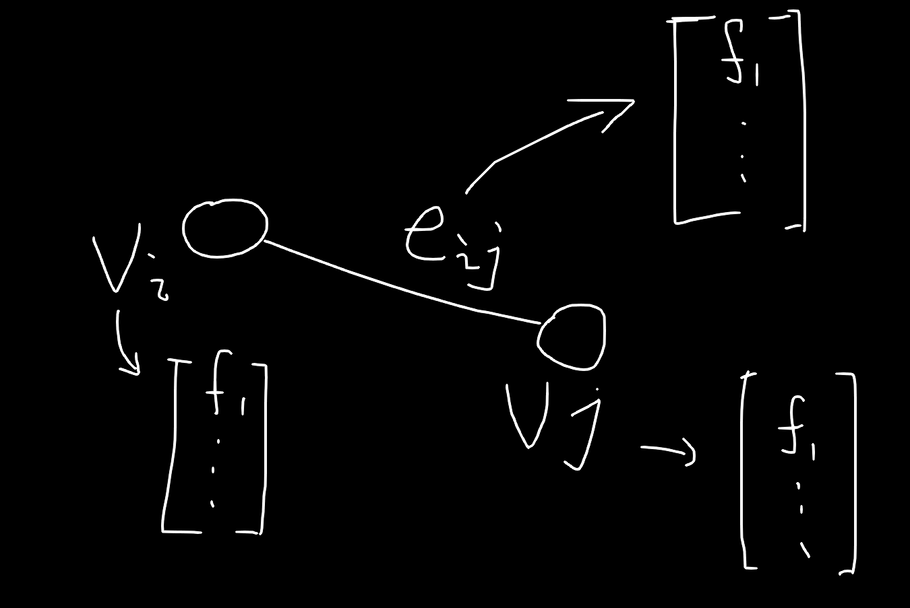
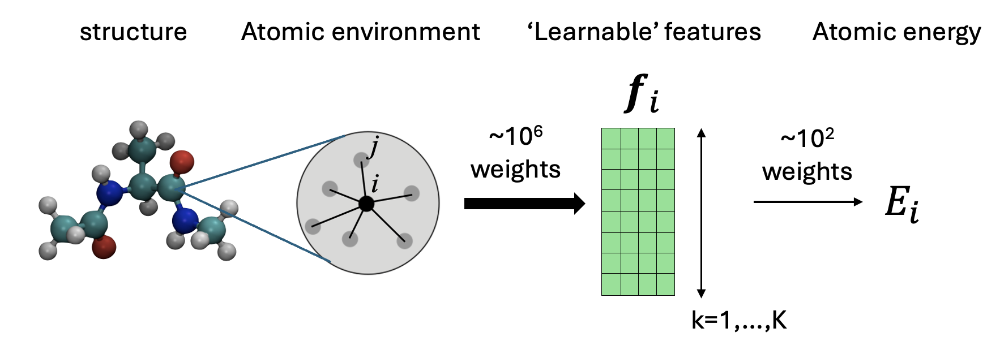
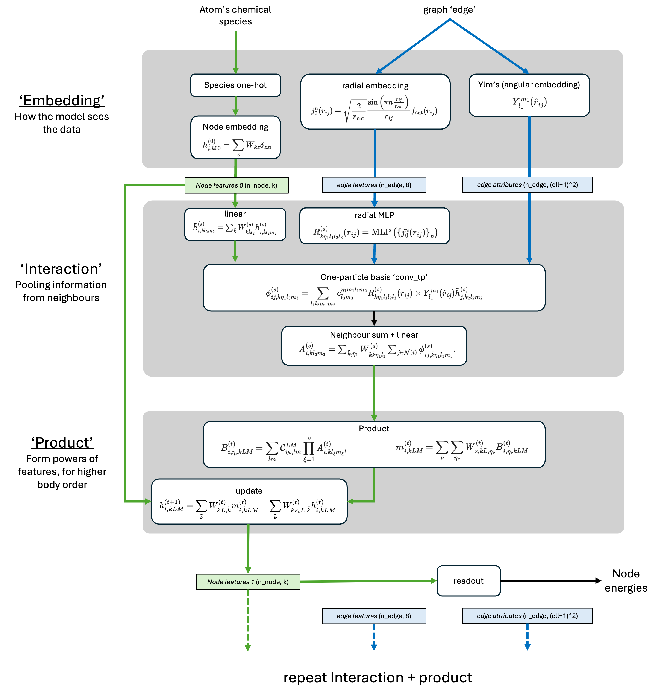
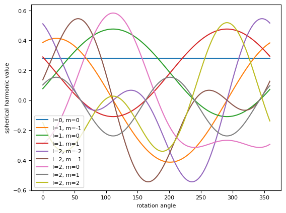
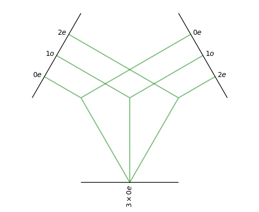
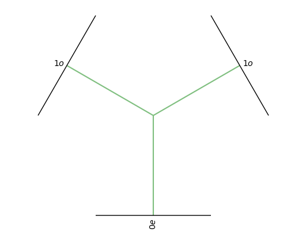
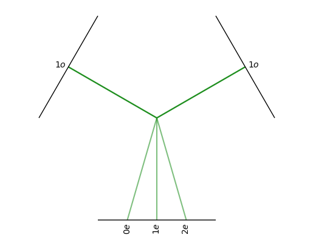
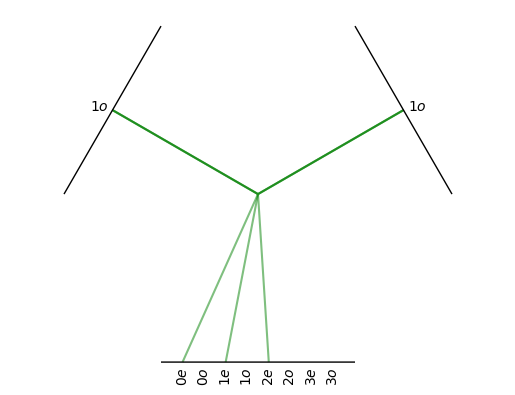

## 内容来源
**https://colab.research.google.com/drive/1AlfjQETV_jZ0JQnV5M3FGwAM2SGCl2aU**

以下内容我不保证理解正确

## MPNN（Message Passing Neural Network）
Ref. Gilmer, J., Schoenholz, S. S., Riley, P. F., Vinyals, O. & Dahl, G. E. Neural Message Passing for Quantum Chemistry. Preprint at https://doi.org/10.48550/arXiv.1704.01212 (2017).

首先，我们的数据结构是图，节点用 $v_i$ 表示，连接 $v_i$ 和 $v_j$ 的边为 $e_{ij}$，其中，节点和边都有属于自己的特征，用 $h$ 表示节点特征，节点的初始特征可以是原子序数，重量，等等性质，一般而言仅使用原子序数就足够了，可以让其通过一个MLP层变成一个高维的特征



每层都是上述这样的图结构，而层与层之间的关系通过消息传递的机制连接起来。对于一个节点而言，他在下一层的特征可以作为该节点在该层本身的特征、该节点该层邻居的特征以及连接它们的边的特征的函数，一般的做法是先计算该节点邻居传递给该节点的消息：

$$m_{i}^{t+1} = \sum_{j} M_{t}(h_{i}^{t},h_{j}^{t},e_{ij})$$

其中 $j$ 为 $i$ 的邻居

$$h_{i}^{t+1} = U_{t}(h_{i}^{t},m_{i}^{t+1})$$

上述两步就是一个节点信息更新的过程，一般重复执行三次左右，然后从最终的图中提取数据，称为 Readout

```
初始化图结构 G (节点特征 h^0)
for l in range(layers):
    # 阶段1：为所有节点计算消息（基于 h^l）
    for v in G:
        m_v = 0
        for u in v的邻居:
            m_v += M(h_v^l, h_u^l, e_{vu})
        将 m_v 临时存储（例如 m[v] = m_v）

    # 阶段2：用算好的消息统一更新所有节点，得到 h^{l+1}
    for v in G:
        h_v^{l+1} = U(h_v^l, m[v])

    # 用 h^{l+1} 替换 h^l 进入下一层
执行 Readout
```
## ACE（Atomic Cluster Expansion）
Ref. https://www.emergentmind.com/topics/atomic-cluster-expansion-ace

$$E_{\text{tot}}\;=\;\sum_{i=1}^N E_i$$

$$E_i = \sum_{\nu=1}^{\nu_{\max}}\sum_{n_1\ldots n_\nu,\,l_1\ldots l_\nu} c_{n_1\ldots n_\nu; l_1\ldots l_\nu} \, B_{n_1\ldots n_\nu; l_1\ldots l_\nu}(i)$$

整个体系的能量被分解到每个原子的贡献上，然后原子的能量则可以展开到一组基 $B_{n_1\ldots n_\nu; l_1\ldots l_\nu}$ 上，这组基是一个标量函数，要求具有旋转不变的性质

## MACE
>MACE is a function which takes in an atomic environment and computes an energy. 

非常粗糙的说法，如果我们不在乎其内部结构的话，几乎所有的机器学习模型都是这样的，一元一次的线性回归方程和神经网络也没什么区别，不过前者需要调整两个参数，而后者需要调整数以万计的参数而已



从上面的图中可以看到，整个MACE可以被分为两个部分，第一个部分是特征构建的过程，约有 1M 数量级的参数，而从特征到能量预测涉及到的参数仅仅数百个



The Figure shows a schematic of MACE. The key steps are:
 - 1) The Embedding. Atomic structures are turned into an initial set of 'features' describing the chemical species of each node, and describing the length and orientation of each edge.
 - 2) Feature Construction
    - 2.1) Interaction: Information is pooled from neighbours
    - 2.2) Product: the information aggregated from neighbours is raised to a power, creating many body descriptors.
    - 2.3) Update: the previous node features are updated based on the output from the product step.
 - 3) Readout. The new features are mapped to an energy.
 - 4) Repeat. The process is repeated, but the informatino describing each node (node features 1) is now much richer than it was in the previous iteration (node features 0).

## 球谐函数

一个最重要的性质如下：

$$ Y_{lm}(R\mathbf{r}) = \sum_{m'} D(R)^l_{mm'} Y_{lm'}(\mathbf{r})$$

在构建特征时，我们会丢入一个位置矢量（3维）然后根据 `l` 会得到不同维度的特征，如 `l=0`，结果为一个标量，`l=1`，结果为一个三维矢量，`l=2`结果为一个五维矢量，这些特征有一个特点，即当输入的位置矢量转动时，输出结果也会相应的转动（改变），称为协变（covariant）。还有一个有趣的点，从上面的公式中可以注意到，$r$ 转动时新的球谐函数的 $l$是不变的，它只是不同 $m$ 的球谐函数的线性组合，因此在 $l$ 固定时的一组球谐函数，可以作为SO(3)转动群不可约表示的一组基

比如下面这个例子
```
# a function for Ylms where we evaluate for l=0,1,2.
spherical_harmonics = o3.SphericalHarmonics([0,1,2], True)

# evaulate spherical harmonics on a vector
vector = torch.tensor([1.0, 0.2, 0.75])
print(spherical_harmonics(vector))

OUT:tensor([ 0.2821,  0.3860,  0.0772,  0.2895,  0.5113,  0.1364, -0.2918,  0.1023, -0.1491])
```
>Why is the array 9 elements long? We calculated the $l=0,1,2$ for all valid $m's$, and stored them in this format: $$[Y_0^0, \ \ Y_{1}^{-1}, Y_{1}^{0},Y_{1}^{1}, \ \ Y_{2}^{-2}, Y_{2}^{-1}, Y_{2}^{0}, Y_{2}^{1}, Y_{2}^{2}, ]$$


函数图像



其中`l=0`是一个旋转不变的函数，下面是一个例子

```
np.random.seed(0)
vector1 = np.random.randn(3)
vector1 = vector1 / np.linalg.norm(vector1)
vector2 = np.random.randn(3)
vector2 = vector2 / np.linalg.norm(vector2)

spherical_harmonics_1 = spherical_harmonics(torch.tensor(vector1))
spherical_harmonics_2 = spherical_harmonics(torch.tensor(vector2))

print('l=0 component for vector 1:', spherical_harmonics_1[0])
print('l=0 component for vector 2:', spherical_harmonics_2[0])

OUT:
l=0 component for vector 1: tensor(0.2821)
l=0 component for vector 2: tensor(0.2821)
```

## e3nn
How do we get Invariants which describe angular information?

To get a more descriptive invariant quantity, we need to do some operations on the spherical harmoincs. We care about how spherical harmonics change when you rotate the input, because its easy to keep track of how rotation affects things. This means that its easy to get back to an invariant quantity when we need to. In MACE, and many other MLIPs, this maths is done by a package called `e3nn`.

`e3nn` provides functions which perform operations on spherical tensors (things with elements like $[Y_{0}^0, Y_{1}^{-1}, Y_{1}^0, ...]$), while keeping track of the rotations. One example operation is a tensor product, which takes two arrays, $A_{lm}$ and $B_{lm}$, and multiplies them to give $C_{lm}$:

$$[A_{lm}] \ \otimes \ [B_{lm}] \ = \ [C_{lm}]$$

The key is that $C$ is still indexed by $l$ and $m$, so if we look at the $l=0$ piece, it will still be invariant! This means we can do a load of operations to combine spherical harmonics, and then create invariant descrpitors which know about things like angles ebtween vectors.

We can demonstrate this by the two vectors above, doing the tensor product of them, and keeping all the outputs which are invariant to rotations.

下面看一个张量积的计算
```
# set up a tensor product.
# This does the product of two l=0,1,2 arrays, and maps the result to three l=0 values.
tensor_product = o3.FullyConnectedTensorProduct(
    irreps_in1=o3.Irreps("1x0e + 1x1o + 1x2e"),
    irreps_in2=o3.Irreps("1x0e + 1x1o + 1x2e"),
    irreps_out=o3.Irreps("3x0e"),
    internal_weights=False
)
print(tensor_product)
# FullyConnectedTensorProduct(1x0e+1x1o+1x2e x 1x0e+1x1o+1x2e -> 3x0e | 9 paths | 9 weights)
tensor_product.visualize()
```


首先解释一下"1x0e + 1x1o + 1x2e"的含义，表示一个`l=0`的偶（even）宇称的量，一个`l=1`的奇宇称（odd）的量，以及一个`l=2`的偶宇称的量，结合上面说的，这是一个9维的量。那么这里的张量积就是说，两个"1x0e + 1x1o + 1x2e"相乘，输出一个"3x0e"的量。这里其实是忽略了一部分量的，因为事实上两个9维的量计算张量积的话，我们会得到一个81维的结果，比如`l=1`与`l=1`的张量积结果是9维，可以分为"1x0 + 1x1 + 1x2"，倘若我们只取`l=0`的结果，就可以写成
```
tensor_product = o3.FullyConnectedTensorProduct(
    irreps_in1=o3.Irreps("1x1o"),
    irreps_in2=o3.Irreps("1x1o"),
    irreps_out=o3.Irreps("1x0e"), # 因为奇乘奇为偶
    internal_weights=False
)
```


当然我们也可以全部留下
```
tensor_product = o3.FullyConnectedTensorProduct(
    irreps_in1=o3.Irreps("1x1o"),
    irreps_in2=o3.Irreps("1x1o"),
    irreps_out=o3.Irreps("1x0e+1x1e+1x2e"), # 同样的奇乘奇为偶，所以只有偶数
    internal_weights=False
)
```


不会有更多了，我们可以强行输出更高的维度，比如
```
tensor_product = o3.FullyConnectedTensorProduct(
    irreps_in1=o3.Irreps("1x1o"),
    irreps_in2=o3.Irreps("1x1o"),
    irreps_out=o3.Irreps("1x0e+1x0o+1x1e+1x1o+1x2e+1x2o+1x3e+1x3o"), 
    internal_weights=False
)
```


可以看到，奇数项，以及更高的 `l` 项就不会再有连线了

下面做一个实际的计算
```
# product the arrays
print(spherical_harmonics_1)
print(spherical_harmonics_2)
product = tensor_product(
    spherical_harmonics_1.unsqueeze(0),
    spherical_harmonics_2.unsqueeze(0),
    weight=torch.arange(1,10,1) # the product has weights which can be trained - for now I have fixed them
)
print('invariant outputs:', product)

OUT:
tensor([ 0.2821,  0.4191,  0.0951,  0.2325,  0.4459,  0.1823, -0.2796,  0.1012,
        -0.2782])
tensor([ 0.2821,  0.3559,  0.2966, -0.1552, -0.2528,  0.4831,  0.0333, -0.2107,
        -0.2347])
invariant outputs: tensor([[0.2524, 0.3480, 0.4436]])

```
注意，这里的九个维度并不是独立的，其中第一个为标量`l=0`，随后三个为`l=0`，被认为是一个三维空间的矢量，之后五个一组`l=2`。下面对输入的位矢转动一下可以看到标量应该是不变的。
```
angle = 77.7 # degrees
rotation_matrix = Rotation.from_rotvec(angle * 2*np.pi * np.array([0, 0.7071, 0.7071])/360).as_matrix()

rotated_vec1 = rotation_matrix @ vector1
rotated_vec2 = rotation_matrix @ vector2

# get the spherical harmpnics
spherical_harmonics_1 = spherical_harmonics(torch.from_numpy(rotated_vec1))
spherical_harmonics_2 = spherical_harmonics(torch.from_numpy(rotated_vec2))

print(spherical_harmonics_1)
print(spherical_harmonics_2)

product = tensor_product(
    spherical_harmonics_1.unsqueeze(0),
    spherical_harmonics_2.unsqueeze(0),
    weight=torch.arange(1,10,1) # the product has weights which can be trained - for now I have fixed them
)
print('invariant outputs:', product)

OUT:
tensor([ 0.2821,  0.1842,  0.4387, -0.1111, -0.0937,  0.3699,  0.4473, -0.2230,
        -0.0494])
tensor([ 0.2821, -0.2363,  0.3647, -0.2233,  0.2415, -0.3944,  0.2118, -0.3727,
        -0.0137])
invariant outputs: tensor([[0.2524, 0.3480, 0.4436]])
```
输出的三个量也是都是`l=0`的，所以也没有变，愿意计算一下的话，应该可以发现，`l=1`的量也发生了同位矢同样幅度的转动，我没算过啊

