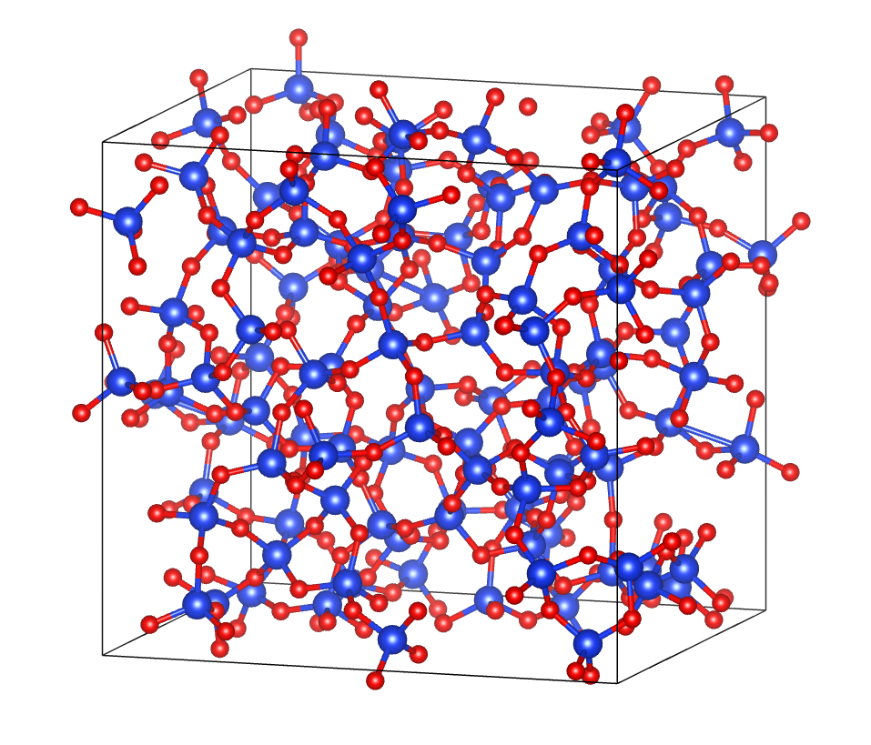

## 分子动力学
把粒子看成经典粒子，用势函数决定它们如何相互作用，用牛顿方程让它们随时间演化，再用统计力学把微观轨迹转换成宏观性质

上述运动方程和统计力学理论框架基本是固定的，但系综和动力学方法可选择，但其中最核心的部分还是势函数的选择，也就是粒子之间的相互作用如何取。一个简单的相互作用势的形式是 Lennard-Jones 势，即:

$$V(r)=4\varepsilon\left[\left(\frac{\sigma}{r}\right)^{12}-\left(\frac{\sigma}{r}\right)^{6}\right]$$

## 势函数
现在做分子动力学的时候一般有经验势（类似上面那种Lennard-Jones势），通过相对少量的参数来实现比较准确的粒子间相互作用的计算，但受限于函数形式、可迁移性和拟合数据，所以经验势很难做到非常准确，特别是在体系较为复杂的情况下。另一端是基于第一性原理的分子动力学，即AIMD，比如从DFT中解出粒子的受力情况，精度高，但计算资源消耗极大，且速度很慢。

过去一些年随着机器学习的发展，也有介于精度和计算速度二者之间的一种势，称为机器学习相互作用势（MLIP）。实际上从某些角度讲，此处的机器学习大多时候指深度学习（DL）（感觉经验势参数的选取也可以被视为一个简单的机器学习参数训练的过程，但没人会说经验势是MLIP）。

## 总之
MD 的框架相对固定，但势函数决定相互作用精度；经验势快但精度和可迁移性有限，AIMD 准但贵，MLIP 用机器学习拟合高维势能面，在二者之间取得平衡，当前以深度学习为主流。

## MACE 与 NEP


MACE: https://github.com/ACEsuit/mace

NEP(GPUMD): https://gpumd.org/index.html


**我只知道这两个**，其实还有别的MLIP

MACE provides fast and accurate machine learning interatomic potentials with higher order equivariant message passing.

NEP uses a simple feedforward neural network (NN) to represent the site energy of atom  as a function of a descriptor vector with  $N_{des}$ components.

从上面的描述其实就可以看出来，MACE基于高阶等变消息传递图神经网络，NEP是一个简单的前馈神经网络。等变图神经网络精度较高，但是计算量大，因此速度较慢（较NEP，即便如此也比DFT快得多），而NEP的简单网络结构使其速度很快（非常非常快），但在复杂环境下精度可能稍差一些。

从描述上看，MACE 采用高阶等变消息传递，属于等变图神经网络/消息传递网络；NEP 则用前馈神经网络把原子局域描述符映射为位点能。两者结构差异确实会影响精度、速度和适用场景。MACE 通过显式编码旋转、平移等对称性和多体消息传递，通常精度和泛化更好，尤其适合复杂体系，但模型更复杂，推理成本通常更高。NEP 网络结构简单、描述符高效，速度极快，适合大规模、长时间 MD，在很多体系中精度也很好，但在复杂化学环境或外推场景下可能不如等变模型。不过这种差异并非绝对，还取决于训练数据、模型大小、实现和硬件。(Deepseek)


## 通用势
如果不做高精度的分子动力学计算，只用熔化退火获取非晶结构的话，可以使用二者的通用势。两个应该都是89种原子的势，基本可以包含大部分情况。

如果只是用熔融退火获取非晶结构，MACE 和 NEP 的 89 元素通用势都可以作为起点，基本覆盖常见体系。但通用势对非晶高能构型的外推能力有限，若对结构细节有要求，可能需要少量非晶数据微调；若体系大、退火时间长，NEP 在速度上的优势会非常明显。(Deepseek)

**我几乎没有使用过经验势，建议在用经验势跑完后做一个结构上键长键角的统计，确保没有不合理的结构出现**


# 试一试
## 安装
安装方法在上面给出的网站上都有，主要注意一点，我建议在一个新的`conda`环境下安装，虽然GPUMD是基于CUDA的，不涉及python环境，但是conda也可以安装一些python环境以外的东西，比如`gcc`或者`gxx`，当然这些东西通过服务器的`module load`也应该有，但是如果你在conda的环境下，你就可以这样对AI说：
```
"我在conda环境下安装 xxx，报错信息如下：xxx，尽量用conda解决"
(你一般会得到缺少 xxx 的回答以及一个 conda install xxx 的指令)
```
这基本可以解决大多数问题，而且非常方便

## MACE
MACE作为一个单独的python库，建议搭配`ase`(https://docs.ase-lib.org/index.html) 使用。比如：
```
from ase import units
from ase.md.langevin import Langevin
from ase.io import read, write
import numpy as np
import time

from mace.calculators import MACECalculator

calculator = MACECalculator(model_path='/content/checkpoints/MACE_model_run-123.model', device='cuda')
init_conf = read('BOTNet-datasets/dataset_3BPA/test_300K.xyz', '0')
init_conf.set_calculator(calculator)
'''
上面这段就是创建了一个MACE的calculator，然后创建一个结构对象，把calculator给到这个结构对象
'''

dyn = Langevin(init_conf, 0.5*units.fs, temperature_K=310, friction=5e-3)
# 选一个系综和动力学方法

def write_frame():
        dyn.atoms.write('md_3bpa.xyz', append=True)
dyn.attach(write_frame, interval=50)
dyn.run(100) # RUN !
print("MD finished!")
```
上面这段教程在:https://mace-docs.readthedocs.io/en/latest/guide/ase.html (让AI去看吧)

## 通用势
这个在MACE的 github 仓库中有，去翻一翻，比如：`MACE-MPA-0`

下载好后放到服务器上
```
(mace) [09-11] @ mace $ ls
mace-mpa-0-medium.model
```
上传一个结构文件，建议是`POSCAR`或者别的常见的格式：


```
(mace) [09-11] @ mace $ ls
mace-mpa-0-medium.model POSCAR
```

然后找AI要一份代码
```
太长了，被我放到末尾了
```
代码放进去，提交任务的脚本放进去，脚本名称不要叫`mace.py`
```
(mace) [09-11] @ mace $ ls
job.slurm  mace-mpa-0-medium.model  POSCAR  run.py
```

结果如下

```
Reading structure: POSCAR
Loading MACE model: mace-mpa-0-medium.model
Initial temperature: 286.24 K

======================================
System information
======================================
Number of atoms : 324
Formula         : O216Si108
PBC             : [ True  True  True]

Cell:
Cell([14.9504804611, 17.2633285522, 16.5599136353])

======================================
MD settings
======================================
Ensemble        : NVT Langevin
Temperature     : 300.0 K
Timestep        : 1.0 fs
Number of steps : 1000
Total MD time   : 1.000 ps
Friction        : 0.001 fs^-1
Device          : cuda

Starting MD...

======================================
MD finished
======================================
Wall time : 576.96 s
Final temperature: 279.22 K

Trajectory : md.xyz
Log        : md.log
Final      : final.xyz
```

## NEP(GPUMD)
这个快

可以在这个位置找到那个通用势
```
(base) [09-11] @ nep89_20250409 $ pwd
/share/home/you/App/gpumd/potentials/nep/nep89_20250409
(base) [09-11] @ nep89_20250409 $ ls
nep89_20250409.restart  nep89_20250409.txt 
```
把他们放到工作目录下
```
(base) [09-11] @ nep $ ls
nep89_20250409.txt
```
这个软件的输入结构文件是`.extxyz`格式，可以用`ovito`转换来，还是上面那个结构
```
(base) [09-11] @ nep $ ls
model.xyz  nep89_20250409.txt
```
这个版本应该比较老了
```
(base) [09-11] @ nep $ gpumd
***************************************************************
*                 Welcome to use GPUMD                        *
*     (Graphics Processing Units Molecular Dynamics)          *
*                     version 5.0                             *
*              This is the gpumd executable                   *
***************************************************************
```
再找AI要一个输入参数，GPUMD是有手册的，可以给到AI
```
也被我放到后面了
```

结果如下(部分)
```
***************************************************************
*                 Welcome to use GPUMD                        *
*     (Graphics Processing Units Molecular Dynamics)          *
*                     version 5.0                             *
*              This is the gpumd executable                   *
***************************************************************


---------------------------------------------------------------
Compiling options:
---------------------------------------------------------------

DEBUG is off: Use different PRNG seeds for different runs.

---------------------------------------------------------------
GPU information:
---------------------------------------------------------------

number of GPUs = 1
Device id:                   0
    Device name:             NVIDIA GeForce RTX 3090
    Compute capability:      8.6
    Amount of global memory: 23.6843 GB
    Number of SMs:           82

---------------------------------------------------------------
Started running GPUMD.
---------------------------------------------------------------


---------------------------------------------------------------
Started initializing positions and related parameters.
---------------------------------------------------------------

Number of atoms is 324.
Use periodic boundary conditions along x.
Use periodic boundary conditions along y.
Use periodic boundary conditions along z.
Box matrix h = [a, b, c] is
    1.4950480461e+01    0.0000000000e+00    0.0000000000e+00
    0.0000000000e+00    1.7263328552e+01    0.0000000000e+00
    0.0000000000e+00    0.0000000000e+00    1.6559913635e+01
Inverse box matrix g = inv(h) is
    6.6887482486e-02    0.0000000000e+00    0.0000000000e+00
    0.0000000000e+00    5.7926256630e-02    0.0000000000e+00
    0.0000000000e+00    0.0000000000e+00    6.0386788363e-02
Do not specify initial velocities here.
Have no grouping method.
There are 89 atom types.
...
    radial cutoff = 6 A.
    angular cutoff = 5 A.
    MN_radial = 274.
    enlarged MN_radial = 343.
    enlarged MN_angular = 198.
    n_max_radial = 4.
    n_max_angular = 4.
    basis_size_radial = 8.
    basis_size_angular = 8.
    l_max_3body = 4.
    l_max_4body = 2.
    l_max_5body = 1.
    ANN = 35-80-1.
    number of neural network parameters = 263441.
    number of descriptor parameters = 712890.
    total number of parameters = 976331.

Start to do an energy minimization.
    using the fast inertial relaxation engine (FIRE) method.
    with fixed box.
    with a force tolerance of 0.0001 eV/A.
    for maximally 5000 steps.

Energy minimization started.
    step 0: total_potential = -2515.2512601614 eV, f_max = 2.1770706325 eV/A.
    step 500: total_potential = -2524.8165413141 eV, f_max = 0.0104049065 eV/A.
    step 1000: total_potential = -2524.8170839548 eV, f_max = 0.0008322188 eV/A.
    step 1135: total_potential = -2524.8170843124 eV, f_max = 0.0000987784 eV/A.
Energy minimization finished.
Initialized velocities with input T = 300 K.
Time step for this run is 0.5 fs.
Use Nose-Hoover thermostat and Parrinello-Rahman barostat.
...
Run 1000000 steps.
MTTK initializing...
    100000 steps completed.

```

### MACE脚本
```
"""
MACE + ASE NVT Molecular Dynamics

Input:
    POSCAR

Output:
    md.xyz      MD trajectory
    md.log      MD log
    final.xyz   Final structure
"""

# ============================================================
# 用户参数
# ============================================================

STRUCTURE_FILE = "POSCAR"
MODEL_FILE = "mace-mpa-0-medium.model"

# MD temperature / K
TEMPERATURE_K = 300.0

# MD timestep / fs
TIMESTEP_FS = 1.0

# Total number of MD steps
N_STEPS = 1000

# Langevin friction coefficient / fs^-1
FRICTION_FS_INV = 0.001

# cuda / cpu
DEVICE = "cuda"

# Random seed
RANDOM_SEED = 12345

# Output interval
TRAJECTORY_INTERVAL = 50
LOG_INTERVAL = 10

TRAJECTORY_FILE = "md.xyz"
LOG_FILE = "md.log"
FINAL_STRUCTURE_FILE = "final.xyz"


# ============================================================
# Imports
# ============================================================

from pathlib import Path
import time
import numpy as np

from ase import units
from ase.io import read, write
from ase.md.langevin import Langevin
from ase.md.logger import MDLogger
from ase.md.velocitydistribution import MaxwellBoltzmannDistribution

from mace.calculators import MACECalculator


def main():

    # ========================================================
    # 1. Check input files
    # ========================================================

    if not Path(STRUCTURE_FILE).is_file():
        raise FileNotFoundError(
            f"Cannot find structure file: {STRUCTURE_FILE}"
        )

    if not Path(MODEL_FILE).is_file():
        raise FileNotFoundError(
            f"Cannot find MACE model: {MODEL_FILE}"
        )


    # ========================================================
    # 2. Load structure
    # ========================================================

    print(f"Reading structure: {STRUCTURE_FILE}")

    atoms = read(
        STRUCTURE_FILE,
        format="vasp",
    )


    # ========================================================
    # 3. Create MACE calculator
    # ========================================================

    print(f"Loading MACE model: {MODEL_FILE}")

    calculator = MACECalculator(
        model_paths=MODEL_FILE,
        device=DEVICE,
    )

    # 将 MACE calculator 绑定到 ASE Atoms
    atoms.calc = calculator


    # ========================================================
    # 4. Initialize velocities
    # ========================================================

    # 固定随机种子
    np.random.seed(RANDOM_SEED)

    # 根据 Maxwell-Boltzmann 分布生成初始速度
    MaxwellBoltzmannDistribution(
        atoms,
        temperature_K=TEMPERATURE_K,
    )

    print(
        f"Initial temperature: "
        f"{atoms.get_temperature():.2f} K"
    )


    # ========================================================
    # 5. Create NVT Langevin dynamics
    # ========================================================

    dyn = Langevin(
        atoms,
        TIMESTEP_FS * units.fs,

        temperature_K=TEMPERATURE_K,

        friction=FRICTION_FS_INV / units.fs,
    )


    # ========================================================
    # 6. Prepare XYZ trajectory
    # ========================================================

    trajectory_path = Path(TRAJECTORY_FILE)

    # 避免重复运行时追加到旧文件
    if trajectory_path.exists():
        trajectory_path.unlink()


    # 保存 t = 0 的初始结构
    write(
        TRAJECTORY_FILE,
        atoms,
        format="extxyz",
    )


    def write_frame():

        write(
            TRAJECTORY_FILE,
            atoms,
            format="extxyz",
            append=True,
        )


    dyn.attach(
        write_frame,
        interval=TRAJECTORY_INTERVAL,
    )


    # ========================================================
    # 7. MD logger
    # ========================================================

    logger = MDLogger(
        dyn,
        atoms,
        LOG_FILE,

        header=True,
        stress=False,
        peratom=False,
        mode="w",
    )

    dyn.attach(
        logger,
        interval=LOG_INTERVAL,
    )


    # ========================================================
    # 8. Print MD information
    # ========================================================

    total_time_ps = (
        TIMESTEP_FS * N_STEPS / 1000.0
    )

    print()
    print("======================================")
    print("System information")
    print("======================================")

    print(f"Number of atoms : {len(atoms)}")
    print(f"Formula         : {atoms.get_chemical_formula()}")
    print(f"PBC             : {atoms.pbc}")

    print()
    print("Cell:")
    print(atoms.cell)

    print()
    print("======================================")
    print("MD settings")
    print("======================================")

    print("Ensemble        : NVT Langevin")
    print(f"Temperature     : {TEMPERATURE_K} K")
    print(f"Timestep        : {TIMESTEP_FS} fs")
    print(f"Number of steps : {N_STEPS}")
    print(f"Total MD time   : {total_time_ps:.3f} ps")
    print(f"Friction        : {FRICTION_FS_INV} fs^-1")
    print(f"Device          : {DEVICE}")


    # ========================================================
    # 9. Run MD
    # ========================================================

    print()
    print("Starting MD...")

    start_time = time.time()

    dyn.run(N_STEPS)

    elapsed_time = time.time() - start_time


    # ========================================================
    # 10. Save final structure
    # ========================================================

    write(
        FINAL_STRUCTURE_FILE,
        atoms,
        format="extxyz",
    )

    logger.close()


    print()
    print("======================================")
    print("MD finished")
    print("======================================")

    print(f"Wall time : {elapsed_time:.2f} s")

    print(
        f"Final temperature: "
        f"{atoms.get_temperature():.2f} K"
    )

    print()
    print(f"Trajectory : {TRAJECTORY_FILE}")
    print(f"Log        : {LOG_FILE}")
    print(f"Final      : {FINAL_STRUCTURE_FILE}")


if __name__ == "__main__":
    main()
```

### GPUMD run.in
```
# ============================================================
# GPUMD melt-quench simulation
# Potential: nep89_20250409.txt
#
# model.xyz : initial structure
# output:
#   dump.xyz   trajectory
#   thermo.out thermodynamic information
#   restart.xyz restart structure
# ============================================================


# -------------------------
# 1. Potential
# -------------------------
potential nep89_20250409.txt


# -------------------------
# 2. Initial relaxation
# -------------------------
# Relax atomic positions before MD
minimize fire 1.0e-4 5000


# -------------------------
# 3. Initial velocities
# -------------------------
velocity 300 seed 12345


# -------------------------
# 4. MD timestep
# -------------------------
# unit: fs
time_step 0.5


# ============================================================
# Stage 1: Heat from 300 K to 4000 K
#
# 100000 steps * 0.5 fs = 50 ps
# heating rate:
# (4000 - 300) / 50 ps = 74 K/ps
#                      = 7.4e13 K/s
# ============================================================

ensemble npt_mttk temp 300 4000 iso 0 0 tperiod 100 pperiod 1000

dump_thermo 100
dump_exyz 1000 0
dump_restart 10000

run 100000


# ============================================================
# Stage 2: Hold liquid at 4000 K
#
# 200000 * 0.5 fs = 100 ps
#
# This stage is important:
# do not immediately cool after reaching 4000 K.
# Give the structure enough time to lose memory
# of the initial crystal.
# ============================================================

ensemble npt_mttk temp 4000 4000 iso 0 0 tperiod 100 pperiod 1000

dump_thermo 100
dump_exyz 1000 0
dump_restart 10000

run 200000


# ============================================================
# Stage 3: Quench from 4000 K to 300 K
#
# 1000000 * 0.5 fs = 500 ps
#
# cooling rate:
# (4000 - 300) / 500 ps
# = 7.4 K/ps
# = 7.4e12 K/s
# ============================================================

ensemble npt_mttk temp 4000 300 iso 0 0 tperiod 100 pperiod 1000

dump_thermo 100
dump_exyz 1000 0
dump_restart 10000

run 1000000


# ============================================================
# Stage 4: Anneal / relax at 300 K
#
# 200000 * 0.5 fs = 100 ps
# ============================================================

ensemble npt_mttk temp 300 300 iso 0 0 tperiod 100 pperiod 1000

dump_thermo 100
dump_exyz 1000 0
dump_restart 10000

run 200000
```