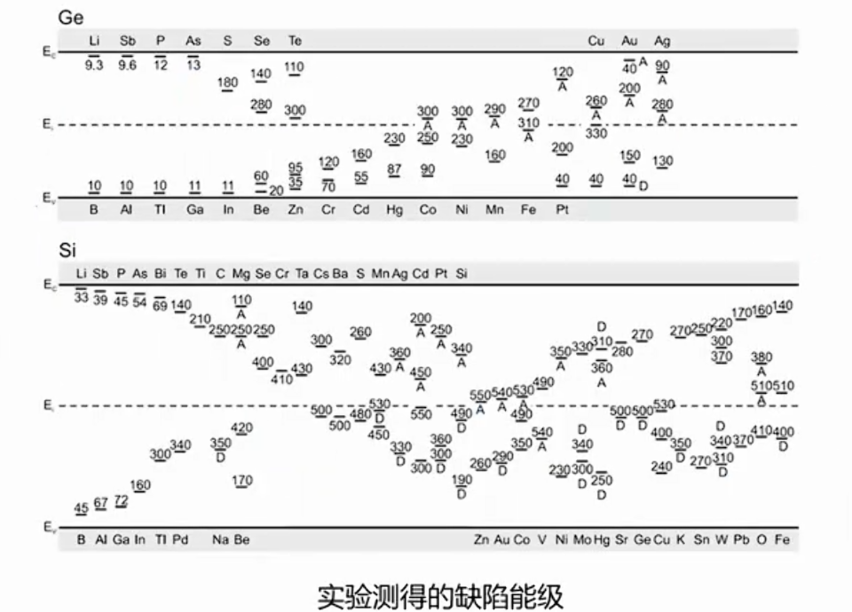
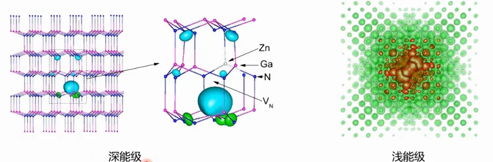
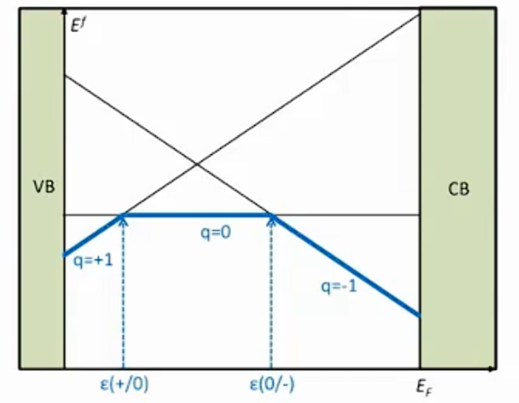
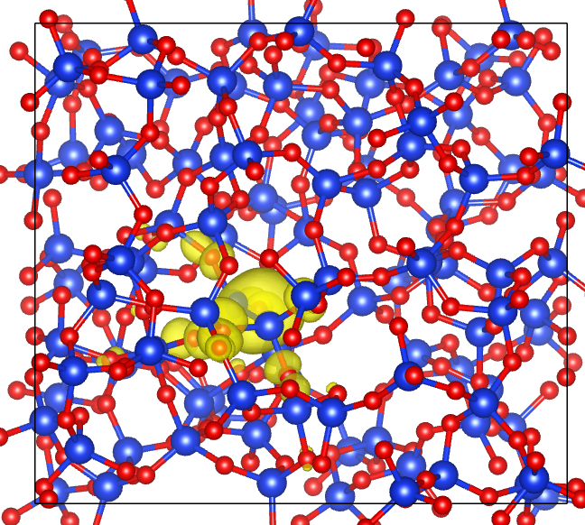

## 点缺陷能级


缺陷能级按照其在带隙中的位置可以分为浅能级（靠近带边）和深能级（原理带边），其中深能级可以作为复合中心，俘获电子或者空穴。从波函数的角度讲，浅能级的波函数一般比较离域，即波函数弥漫在缺陷附近的大片空间，深能级的波函数则十分局域，一般就在只在缺陷附近。



上面就是两者典型的区别，左侧深能级的结构是96个原子的胞，缺陷能级的波函数只在局限在一个小范围内，右侧是一个数千原子的胞，浅能级缺陷的波函数几乎覆盖了整个胞。因此相对而言，对于DFT计算而言，深能级缺陷比较好研究。
## 点缺陷分类
有本征缺陷包括空位、反位、间隙。外来杂质缺陷包括替位、间隙。也有一些更复杂的点缺陷形式，点缺陷计算普遍使用超胞法（建立一个尽可能大的晶胞，在这个晶胞中制造一个点缺陷）

## 缺陷形成能与缺陷转变能级
缺陷形成能，顾名思义就是指形成一个缺陷所需的能量，实际计算中采用下面的公式

$$E(X) = E_{total}(X) − E_{bulk} + ∑_{i} n_{i}μ_{i} + qE_{F} + E_{corr}$$

$E_{total}(X)$ 代表缺陷体系的总能，$E_{bulk}$代表无缺陷bulk体系总能，$μ_{i}$代表原子化学势，单个原子的化学势通过依赖于具体的生长环境，通常是一个能量范围，在实际画图中通常取化学势的最大值或最小值，对应于缺陷能级图中的rich或者poor的情况。$q$表示体系带电量，$E_{F}=\varepsilon+E_{VBM}$代表外部电子化学势，$E_{corr}$则表示有限尺寸和镜像电荷的能量修正。需要注意的是，这里的缺陷体系通常需要扩为足够大的方胞。

>一个粗糙的说明，缺陷形成能表示形成一个缺陷所需的能量，以氧空位缺陷的形成为例，其中前两项能量之差表示把缺陷和完美晶体（Bulk）分离所需的能量（体系能量升高），以及这之后体系需要重新驰豫，会放出一部分能量（补偿），接着单个缺陷需要重新融入环境中（单个O原子不可能独立存在，会以氧气分子，或者水分子等各种化合的状态存在，这就是化学势项，这一步同样会释放一部分能量，作为补偿项），此外，如果缺陷需要带电，需要从外界获取一个电子/释放出一个电子，获取电子的能量是费米能，会导致体系能量升高/降低，这一项只是从外界电子库获取/放入电子所需的能量，驰豫后的补偿在前两项中就被计算了。最后一项为DFT计算的修正项。



一个典型的结果如图所示，缺陷形成能最终会是 $q$ 的函数，而转变能级则对应着不同电荷态的缺陷形成能的交点，在转变能级处，缺陷可以在两种电荷态之间相互转换。

形成能用来判断一个缺陷在热力学上的性质，即这个缺陷的稳定性，以及缺陷的浓度。转变能级则用来判断缺陷的电学性质

The experimental significance of this level is that for Fermi-level positions below $\varepsilon(q_{1}/q_{2})$, charge state $q_{1}$ is stable, while for Fermi-level positions above $\varepsilon(q_{1}/q_{2})$, charge state $q_{2}$ is stable.

Transition levels correspond to thermal ionization energies. Conventionally, if a transition level is positioned such that the defect is likely to be thermally ionized at room temperature (or at device operating temperatures), this transition level is called a shallow level; if it is unlikely to be ionized at room temperature, it is called a deep level.

讲两个点：

In principle, internal excitations of the defect can occur in which the charge state of the defect remains unchanged. More commonly, however, carriers are exchanged with the semiconductor host and a transition to a different charge state occurs.

这是说，缺陷的状态改变有两种情况，一种是缺陷内部本身的电子发生一个能级的改变，但是整个缺陷的带电量不会发生改变，类似于一个分子中的电子发生跃迁换了一个能级，但是整个分子依旧是中性的。另一种也就是我们此处讨论的情况，即缺陷从外界背景中（semiconductor host）中获取了一个电子/空穴，使得缺陷的电荷状态发生改变。

These different charge states may correspond to quite different local lattice configurations. It is important to realize that the Kohn-Sham (KS) levels that result from a bandstructure calculation for the center cannot directly be identified with any levels that are relevant for experiment, even if there were no concerns about the accuracy of the KS band gap. Instead, the total energies of the defect configurations before and after the transition must be considered.

电荷态的改变会同时改变晶格结构（电子-声子耦合），我们虽然可以从K-S的结果中读到缺陷能级的位置，但是这个数据不能直接用来与实验结果做比对，必须考虑缺陷电荷态改变对结构造成的影响

Ref. Freysoldt, C. et al. First-principles calculations for point defects in solids. Rev. Mod. Phys. 86, 253–305 (2014).

## 原子化学势
如上所述，这里的化学势实际上是单质化合后所释放的能量，所以对于不同的化合物，计算出的原子的化学势并不一致，取决于实际的制备条件

>ToDo 详细说明

## 电子化学势
即费米能级，可以通过外界条件改变，因此此处为一个变量

## 能量修正项
势能影响和静电相互作用

## 计算流程
下面的结构优化过程全部使用PBE泛函，SCF计算全部使用HSE泛函

1、对初始结构（无缺陷结构）进行结构优化，作为Host（Bulk），顺便做一次SCF

2、扩胞，构建缺陷结构（中性、+q、-q ...）

3、对上述构造出的缺陷结构进行结构优化（保持与Host的晶格常数一致，即只优化原子位置）

4、对优化后的结构进行SCF计算

5、原子化学势的计算、修正项的计算

6、汇总

## Example Vo@SiO2
1、Host为包含324个原子的 Amor-SiO2 结构，对其进行结构优化，参数如下
```
16 1
job = relax 

# scf
rho_error = 1.0e-5
e_error = 0.0 # 1.0e-5
wg_error = 0.0
ecut = 50
ecut2 = 200
mp_n123 = 1 1 1 0 0 0 0 
xcfunctional = pbe 
relax_detail = 1, 500, 0.02, 0, 0.01 # 不要优化晶格，受力收敛不了 ~

# input
in.atom = atom.config
spin = 1 
## pseudo potential
in.psp1 = Si.SG15.PBE.UPF
in.psp2 = O.SG15.PBE.UPF

# in.wg = t
# in.rho = t
# in.vr = t
# in.kpt = t

# output
out.wg = f
out.rho = f
out.vr = f
out.force = t
out.stress = t
```
>确保电子步（SCF）收敛，以及最后的总受力达标，可以查看 RELAXSTEPS 文件

```
It=  160 CORR E=  -0.1056701980731E+06  Av_F=  0.52E-02 M_F=  0.25E-01 dE=  0.26E-04 dRho=  0.50E-05 SCF=     3 dL= -0.55E-02 p*F= -0.31E-02 p*F0= -0.67E-01 Fch=  0.81E+00
It=  161  NEW E=  -0.1056701985283E+06  Av_F=  0.42E-02 M_F=  0.25E-01 dE=  0.85E-04 dRho=  0.58E-05 SCF=     5 dL=  0.34E-02 p*F= -0.17E-01 p*F0= -0.74E-01 Fch=  0.12E+01
It=  162 CORR E=  -0.1056701985093E+06  Av_F=  0.52E-02 M_F=  0.35E-01 dE=  0.37E-04 dRho=  0.38E-05 SCF=     3 dL=  0.44E-02 p*F= -0.33E-02 p*F0= -0.74E-01 Fch=  0.10E+01
It=  163  NEW E=  -0.1056701988853E+06  Av_F=  0.39E-02 M_F=  0.16E-01 dE=  0.31E-04 dRho=  0.91E-05 SCF=     4 dL=  0.35E-02 p*F= -0.30E-01 p*F0= -0.67E-01 Fch=  0.94E+00
It=  164 *END E=  -0.1056701988853E+06  Av_F=  0.39E-02 M_F=  0.16E-01 dE=  0.31E-04 dRho=  0.91E-05 SCF=     4 dL=  0.35E-02 p*F= -0.30E-01 p*F0= -0.67E-01 Fch=  0.94E+00
```

2、对 Host 结构优化完成后，换 HSE 泛函进行一次 SCF 计算，注意最后计算出的带隙要合理

下面的数据来自 OUT.OCC

0.8063 - 7.7613 默认参数 alpha=0.25 omega=0.2 beta=0.0

0.4094 - 8.1154 beta=0.25，其余默认

-0.5820 - 8.2459 alpha=0.5，其余默认，计算时间从800+s 到了 1000+s 

带隙大约 8.8 eV ，足够合理，后续 HSE 计算使用 alpha=0.5，omega=0.2，beta=0.0
```
16 1

job = scf 

# scf
rho_error = 1.0e-5
e_error = 0.0 # 1.0e-5
wg_error = 0.0
ecut = 50
ecut2 = 200
mp_n123 = 1 1 1 0 0 0 0 

xcfunctional = hse
hse_omega = 0.2
hse_alpha = 0.5
hse_beta = 0.0

# input
in.atom = atom.config
spin = 1 

## pseudo potential
in.psp1 = Si.SG15.PBE.UPF
in.psp2 = O.SG15.PBE.UPF

# in.wg = t
# in.rho = t
# in.vr = t
# in.kpt = t

# output
out.wg = t
out.rho = t
out.vr = t
out.force = t
out.stress = t
out.vatom = t
```

3、构建缺陷结构（在优化好的 Host 的合适的位置处挖去一个 O 原子），然后进行结构优化（不优化晶格），参数如下

删除 Host 中的 Atom: 247  O139   O   0.41846   0.60278   0.44260  ( 0  0  0)+ x, y, z


```
16 1
job = relax 

# scf
rho_error = 1.0e-5
e_error = 0.0 # 1.0e-5
wg_error = 0.0
ecut = 50
ecut2 = 200
mp_n123 = 1 1 1 0 0 0 0 
xcfunctional = pbe 
relax_detail = 1, 500, 0.02, 0, 0.01 # 不要优化晶格，受力收敛不了 ~

# input
in.atom = atom.config
spin = 2 # 缺陷计算开启自旋 
## pseudo potential
in.psp1 = Si.SG15.PBE.UPF
in.psp2 = O.SG15.PBE.UPF

# in.wg = t
# in.rho = t
# in.vr = t
# in.kpt = t

# output
out.wg = f
out.rho = f
out.vr = f
out.force = t
out.stress = t
```

4、同样的换 HSE 泛函进行一次 SCF 计算，输出所需的各种量

参数同 Host ，但是开启自旋

计算结束后检查 OUT.OCC

```
858     -0.6845   1.00000
859     -0.6629   1.00000
860     -0.5458   1.00000
861      0.2317   1.00000
862      8.2573   0.00000
863      8.9108   0.00000
```

可以看到在带隙中 0.2317 eV 处出现了一个新的能级

使用 plot_wg.x 绘制其波函数
```
(base) [11:29:32] ~/Work/Vo@SiO2/Vo_q0 $ plot_wg.x 
 there are            1  kpoints # 此处只有一个 Gamma 点
 input the ikpt to plot wg
1 # 也只能选择第一个 k 点 ，即 Gamma 点，不过对于 Amor 结构而言，其实都一样
 input the name of OUT.WG file
OUT.WG # 开启自旋后还会输出一个 OUT.WG_2 这是另一个自旋，OUT.OCC 中被分为了两个自旋态，此处取第一个自旋态
 input the name of xatom.config file
atom.config # 结构文件
 there are         1096 wavefunction, input ind im to plot
861 # 能级编号
 charge(G-space)=  0.999999999999995     
 charge(R-space)=   1.00000000000000     
 PSI^2 is written in PSI.xsf
 real part of PSI is written in REAL_PSI.xsf
 imaginary part of PSI is written in IMAG_PSI.xsf
```
上面整个过程表示，输出第1个k点（Gamma点）的 第 861 号能级的第 1 个自旋态的波函数

图像如下



波函数局域在缺陷附近，为一个典型的深能级缺陷

检查 SPIN 2，861号能级也被占据，能级相同，感觉可以不开自旋...

同时可以看一下 VBM 与 CBM 的波函数，也有其特点，分别是 860 和 862号，如下
```
(base) [11:48:50] ~/Work/Vo@SiO2/Vo_q0 $ echo -e "1\nOUT.WG\natom.config\n860\n" | plot_wg.x  # 这个指令更便捷
 there are            1  kpoints
 input the ikpt to plot wg
 input the name of OUT.WG file
 input the name of xatom.config file
 there are         1096 wavefunction, input ind im to plot
 charge(G-space)=  0.999999999999994     
 charge(R-space)=  0.999999999999983     
 PSI^2 is written in PSI.xsf
 real part of PSI is written in REAL_PSI.xsf
 imaginary part of PSI is written in IMAG_PSI.xsf
```

5、此时的缺陷为中性，上面占据一个电子（其实是两个），可以移走一个电子，使用参数
```
NUM_ELECTRON =   1722.00000000000
```
这个参数在 REPORT 中可以找到，这个是中性结构的价电子数，修改为 1721 即为移除一个电子，移除的这个电子为最高被占据能级的电子，所以需要保证这个能级为缺陷能级，就像这里一样，然后进行结构优化，输入参数如下，此时缺陷处于 +1 态
```
16 1
job = relax 
# scf
rho_error = 1.0e-5
e_error = 0.0 # 1.0e-5
wg_error = 0.0
ecut = 50
ecut2 = 200
mp_n123 = 1 1 1 0 0 0 0 
xcfunctional = pbe 
relax_detail = 1, 500, 0.02, 0, 0.01 
# input
in.atom = atom.config
NUM_ELECTRON =   1721.00000000000 # 去掉一个电子
spin = 2 
## pseudo potential
in.psp1 = Si.SG15.PBE.UPF
in.psp2 = O.SG15.PBE.UPF
# in.wg = t
# in.rho = t
# in.vr = t
# in.kpt = t
# output
out.wg = f
out.rho = f
out.vr = f
out.force = t
out.stress = t
out.vatom = f
```

6、结构优化后使用 HSE 进行 SCF 计算，输出所需结果
```
16 1

job = scf 

# scf
rho_error = 1.0e-5
e_error = 0.0 # 1.0e-5
wg_error = 0.0
ecut = 50
ecut2 = 200
mp_n123 = 1 1 1 0 0 0 0 

xcfunctional = hse
hse_omega = 0.2
hse_alpha = 0.5
hse_beta = 0.0

# input
in.atom = atom.config
NUM_ELECTRON =   1721.00000000000 # 去掉一个电子
spin = 2 

## pseudo potential
in.psp1 = Si.SG15.PBE.UPF
in.psp2 = O.SG15.PBE.UPF

# in.wg = t
# in.rho = t
# in.vr = t
# in.kpt = t

# output
out.wg = t
out.rho = t
out.vr = t
out.force = t
out.stress = t
out.vatom = t
```

查看 OUT.OCC
```
SPIN 1
859     -0.6176   1.00000 
860     -0.5898   1.00000 # VBM
861     -0.3170   1.00000 # Defect
862      7.4417   0.00000 # Defect ？
863      8.2151   0.00000 # CBM
SPIN 2
859     -0.6167   1.00000
860     -0.5896   1.00000 # VBM
861      3.9015   0.00000 # Defect
862      8.2414   0.00000 # CBM
863      8.5865   0.00000
```
此处自旋就分开了，检查一下这些态的波函数

7、化学势的计算

这里只需要计算 O 的化学势

> Todo

8、数据处理

到此为止，就计算了 Host 的数据，中性态 Vo@Host 的数据，+1态 Vo@Host 的数据，以及需要用到的化学势，将计算结果整理成这样的目录结构
```
├ calculate/
│   ├── bulk/
│   │   └── scf/
│   │       ├── REPORT
│   │       ├── atom.config 或 final.config
│   │       └── OUT.VATOM
│   └── Vo/
│       ├── q_0/
│       │   └── scf/
│       │       ├── REPORT
│       │       ├── atom.config 或 final.config
│       │       ├── OUT.OCC
│       │       └── OUT.VATOM
│       ├── q_-1/
│       │   └── scf/
│       │       ├── REPORT
│       │       ├── atom.config
│       │       └── OUT.OCC
│       └── q_1/
│           └── scf/
│               ├── REPORT
│               ├── atom.config
│               └── OUT.OCC
```

>脚本位置 ToDo

设置 config.yaml
```
system:
  name: "Vo in SiO2"
  dielectric: 3.9
  VBM: -0.582
  gap: 8.8
  elements: [Si, O]
  chemical_potential:
    O: -435.32
structure:
  defect_center:[0.392, 0.615, 0.403] # 这里有BUG，代码会先自动识别，失败后才会读取这里,可以代码中手动指定，batch_correction.py : 1017，谁来修一下 ~
formation_energy:
  charge: [0,1]
  e_corr: true
```
执行
```
python batch_correction.py prepare
```
输出如下
```
(defect_my) [16:00:31] ~/Work/Vo@SiO2 $ python batch_correction.py prepare
已加载配置: ***/Vo@SiO2/config.yaml
project_root : ***/Vo@SiO2
calc_dir : ***/Vo@SiO2/calculate
============================================================
  批量生成 defect.input
============================================================
检测到 1 个缺陷目录

--- 缺陷: Vo ---
  缺陷位置: 0.392000 0.615000 0.403000
  带电态: [1]
  已生成: ***/Vo@SiO2/calculate/Vo/q_1/scf/defect.input, ***/Vo@SiO2/calculate/Vo/q_0/scf/defect_+1.input, ***/Vo@SiO2/calculate/Vo/q_0/scf/defect_p1.input

共生成 1 个 defect.input 文件

接下来请在 HPC 上依次执行:

  # Vo q=+1
  cd ***/Vo@SiO2/calculate/Vo/q_1/scf
  cp ***/Vo@SiO2/calculate/Vo/q_0/scf/OUT.OCC OUT.OCC0
  cp OUT.OCC OUT.OCC1
  bash ***/Vo@SiO2/1_get_rho.sh # 目录下的slurm脚本改成job.sh名称, 不然就改代码
  bash ***/Vo@SiO2/2_coulomb_integral.sh # 等待任务计算完成
  bash ***/Vo@SiO2/3_get_results.sh

全部修正完成后，运行: python ***/Vo@SiO2/batch_correction.py collect
```
bash ***/Vo@SiO2/3_get_results.sh 的输出如下
```
----------------------- Coulomb ingetrals -------------------------
E_\infty =  4.73619    E_P =  3.50710 
 
 
------------------- Potential alignment -------------------
The defect coordinates:  0.392000 0.615000 0.403000
neutral: the farest atom from the defect coordinates, pot:
 126  0.92399  0.08799  0.90706 -43.474618965 -43.474618630
bulk: the farest atom from the defect coordinates, pot:
 126  0.92416  0.08853  0.90791 -43.470489030
 
--------------------Finished ( * ~ * )_Y-------------------
```
结果 python /***/batch_correction.py collect --corr icic ，这里只使用 ICIC
```
已加载配置: ***/Vo@SiO2/config.yaml
命令行指定修正模式: icic
======================================================================
  收集修正结果 & 计算形成能 / 转变能级
======================================================================
E_bulk = -105644.2550937 eV
VBM = -0.582 eV
Gap = 8.8 eV
化学势: {'O': -435.32}
介电常数: 3.9
修正模式: icic  (ICIC / no PA)


──────────────────────────────────────────────────
缺陷: Vo
  原子数变化: {'O': -1}
  q=  0  E_raw= -105207.44654 eV  E_corr=   0.00000 eV  
  q= +1  E_raw= -105209.42473 eV  E_corr=   0.31515 eV  ✓ ICIC

======================================================================
  形成能 & 转变能级
======================================================================

--- Vo ---
  E_f(q=0, E_F) = 1.48855 eV
  E_f(q=+1, E_F) = -0.75649 + E_F  (eV)
  ε(0/+1) = 2.2450 eV [带隙内]
  YAML 结果已写入: ***/Vo@SiO2/result/defect_results.yaml
  E_f 表格已写入: ***/Vo@SiO2/result/E_forms/E_formation_corrected_Vo.txt

======================================================================
  完成
======================================================================
```