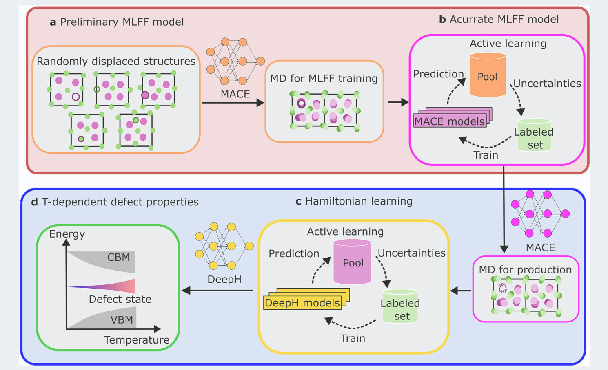
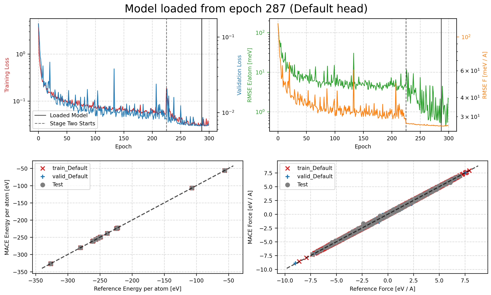

## Workflow


Zhu, X., Rinke, P. & Egger, D. A. Predicting temperature-dependent optoelectronic properties of semiconductor defects with equivariant neural networks. npj Comput Mater 12, 176 (2026).

上面这幅图就是一个完整流程图，先随机生成一些简单的数据集，用这些数据集训练多个 MACE 模型，组成一个 Committee，之后使用其中一个 MACE 模型进行 MD 计算，边跑 MD 边用这些 MACE 模型进行能量和受力的预测，如果多个模型的分歧较大，说明此时的结构未被 MACE 很好的学习到，那么就对其进行 DFT 计算，添加到数据集中，待数据集足够时，在上述训练好的模型基础上继续训练，如此循环几轮，可以提高模型的性能。同样的，对 DeepH 的训练也是如此。

## Example $Amor-SiO_{2}$

### Committee MACE 训练
初始数据集使用非晶的 $SiO_2$，训练参数如下
```
model: "MACE"
num_channels: 128
max_L: 1
r_max: 5.0
name: "mace_sio2-si"
model_dir: "MACE_models"
log_dir: "MACE_models"
checkpoints_dir: "MACE_models"
results_dir: "MACE_models"
train_file: "./train.xyz"
valid_file: "./validation.xyz"
test_file: "./test.xyz"
energy_key: "energy"
forces_key: "forces"
E0s: "average"
# device: cpu
device: cuda
batch_size: 1
max_num_epochs: 300
lr: 0.01
swa: True
swa_lr: 0.001
energy_weight: 1.0
forces_weight: 100.0
swa_energy_weight: 1000.0
seed: 42 # 通过修改 seed 以获取不同的 MACE 模型，加入 Committee，其余参数保持一致
enable_cueq: False
``` 
训练结果如下



### Committee MD 计算与不确定性评估
```
import os
import numpy as np
from ase.io import read, write
from mace.calculators import MACECalculator
from ase import units
from ase.md.langevin import Langevin
from ase.md.bussi import Bussi
from ase.md.velocitydistribution import Stationary, ZeroRotation, MaxwellBoltzmannDistribution

# ---------- 1. 模型 ----------
model_paths = [
    "/share/home/***/model1/MACE_models/mace_sio2-si.model",
    "/share/home/***/model2/MACE_models/mace_sio2-si.model",
    "/share/home/***/model3/MACE_models/mace_sio2-si.model",
    "/share/home/***/model4/MACE_models/mace_sio2-si.model",
]
calculators = [MACECalculator(model_paths=mp, default_dtype="float32") for mp in model_paths]

# ---------- 2. 初始结构 ----------
atoms = read("sio2.vasp")
atoms.calc = calculators[0]

# ---------- 3. 初始温度 ----------
MaxwellBoltzmannDistribution(atoms, temperature_K=300)
Stationary(atoms)
ZeroRotation(atoms)

# ---------- 4. 准备全轨迹文件（extxyz） ----------
full_traj_file = "full_md_trajectory.xyz"
if os.path.exists(full_traj_file):
    os.remove(full_traj_file)  # 清空旧文件，保证从头开始

atoms.calc.get_forces(atoms)  # 触发计算，保证atoms上已有能量和力
write(full_traj_file, atoms)  # 写入第0步结构

def save_frame():
    """每一步MD后保存构型到extxyz文件"""
    write(full_traj_file, atoms, append=True)

# ---------- 5. 动力学 ----------
# dyn = Langevin(atoms, 1.0 * units.fs, temperature_K=1500, friction=0.1)
dyn = Bussi(atoms, 1.0 * units.fs, temperature_K=3000, taut=500 * units.fs)
dyn.attach(save_frame, interval=1)  # 每步记录

# ---------- 6. 委员会不确定性评估函数 ----------
def committee_uncertainty(atoms, calculators):
    energies = []
    forces_list = []
    for calc in calculators:
        energies.append(calc.get_potential_energy(atoms))
        forces_list.append(calc.get_forces(atoms))
    energies = np.array(energies)
    forces = np.array(forces_list)           # (n_models, n_atoms, 3)
    e_std = np.std(energies) / len(atoms)   # eV/atom
    force_std_per_atom = np.std(forces, axis=0)  # (n_atoms, 3)
    max_force_std = np.max(np.linalg.norm(force_std_per_atom, axis=1))
    return e_std, max_force_std

# ---------- 7. 主动学习参数 ----------
check_interval = 10
energy_std_threshold = 0.05   # 根据你的体系调整
force_std_threshold = 0.1 # 同样可调
candidate_file = "candidates.xyz"
if os.path.exists(candidate_file):
    os.remove(candidate_file)

# ---------- 8. MD 循环 ----------
total_steps = 1000

for step in range(0, total_steps, check_interval):
    dyn.run(check_interval)
    
    # 委员会不确定性评估（每 check_interval 步）
    e_std, f_std = committee_uncertainty(atoms, calculators)
    print(f"Step {dyn.nsteps}: energy_std = {e_std:.6f} eV/atom, max_force_std = {f_std:.6f} eV/Å")
    
    if e_std > energy_std_threshold or f_std > force_std_threshold:
        write(candidate_file, atoms, append=True)
        print(f"  -> High-uncertainty structure saved at step {dyn.nsteps}")
```

### 对 candidate.xyz 执行 DFT 计算
用到的代码

1、将 xyz 文件转换为 POSCAR 文件，方便后续处理

```
"""将 extxyz 文件转换为多个 POSCAR 文件"""

import argparse
import os
from ase.io import read, write


def main():
    parser = argparse.ArgumentParser(description="将 extxyz 文件拆分为多个 POSCAR 文件")
    parser.add_argument("input", help="输入的 extxyz 文件路径")
    parser.add_argument("-o", "--output-dir", default="strus",
                        help="输出目录 (默认: strus)")
    parser.add_argument("-s", "--start", type=int, default=1,
                        help="起始编号 (默认: 1)")
    parser.add_argument("-n", "--num-digits", type=int, default=3,
                        help="编号位数 (默认: 3)")
    args = parser.parse_args()

    # 读取所有结构
    atoms_list = read(args.input, index=":")
    print(f"共读取 {len(atoms_list)} 个结构")

    # 逐个写入 POSCAR
    for i, atoms in enumerate(atoms_list, start=args.start):
        dir_name = str(i).zfill(args.num_digits)
        out_dir = os.path.join(args.output_dir, dir_name)
        os.makedirs(out_dir, exist_ok=True)
        out_path = os.path.join(out_dir, "POSCAR")
        write(out_path, atoms, format="vasp")
        print(f"  [{i:>{args.num_digits}}] -> {out_path}")

    print("完成!")


if __name__ == "__main__":
    main()
```

2、调用 Atomkit 将 POSCAR 文件转换为 ABACUS 的输入文件 STRU 文件

```
#!/bin/bash
original_dir="$PWD"   

shopt -s nullglob

for dir in ./strus/*/; do 
    [ -d "$dir" ] || continue

    echo "正在处理目录: $dir"
    cd "$dir" || { echo "无法进入 $dir"; continue; }

    echo -e "101\n175 POSCAR\n" | atomkit && mv -v POSCAR.STRU STRU

    cd "$original_dir" || { echo "无法返回原目录"; exit 1; }

```

3、执行计算
```
#!/bin/bash

# 执行 python ./convert.py candidates.xyz
python ./convert.py candidates.xyz

# 执行 bash ./poscar2abacus.sh
bash ./poscar2abacus.sh

# 执行 cp ./INPUT ./strus/
cp ./INPUT ./strus/

# 执行 cp ./KPT ./strus/
cp ./KPT ./strus/

# 执行 cp ./abacus.slurm ./strus/
cp ./abacus.slurm ./strus/

# 执行 cd ./strus/
cd ./strus/

# 执行 sbatch ./abacus.slurm
sbatch ./abacus.slurm
```
### DFT 计算结果处理
用到的代码
```
import os, sys, json
import numpy as np
from ase.io import read, write

def main():
    if len(sys.argv) != 3:
        print("Usage: python single-abacus2nep.py <dir> <xyz>")
        sys.exit(1)
if __name__ == "__main__":
    main()

def get_scf_info(root):
    scf_nmax = None
    input_file = os.path.join(root, "INPUT")
    if os.path.exists(input_file):
        with open(input_file, 'r') as file:
            for line in file:
                line = line.strip()
                if 'scf_nmax' in line:
                    scf_nmax = int(line.split()[1])
    else:
        scf_nmax = 100
        print(f"{root} doesn't know the scf_max value, default to 100")
    return scf_nmax

for root, dirs, files in os.walk(os.path.abspath(sys.argv[1])):
    scf_count, Total_Time, virial = 0, 0, None
    if "running_scf.log" in files:
        log_file = os.path.join(root, "running_scf.log")
        scf_nmax = get_scf_info(root)
        with open(log_file, 'r') as file_log:
            for line in file_log:
                line = line.strip()
                scf_count += line.count("ALGORITHM")
                Total_Time += line.count("Total  Time")
        if scf_count == scf_nmax or Total_Time == 0:
            print(f"Directory {root} has not completed the calculation or has not converged")
            continue
        atoms = read(log_file, format='abacus-out') #pip install git+https://gitlab.com/1041176461/ase-abacus.git
        natoms = len(atoms)
        cell = np.concatenate([atoms.get_cell()[0], atoms.get_cell()[1], atoms.get_cell()[2]])
        energy = atoms.get_potential_energy()
        if atoms.calc.get_stress() is not None:
            xx,yy,zz,yz,xz,xy = atoms.calc.get_stress()
            stresses = [xx, xy, xz, xy, yy, yz, xz, yz, zz]
            virial = [f"{-s:.10f}" for s in [stress * atoms.get_volume() for stress in stresses]]
        else:
            print(f"This structure does not calculate stress in {root}, please add cal_stress in INPUT")
        symbols = atoms.get_chemical_symbols()
        positions = atoms.get_positions()
        forces = atoms.get_forces()
    elif "abacus.json" in files and "running_scf.log" not in files:
        print(f"Directory {root} with abacus.json")
        json_file = os.path.join(root, "abacus.json")
        scf_nmax = get_scf_info(root)
        with open(json_file, 'r', encoding='utf-8') as file_json:
            data = json.load(file_json)
        scf_count = len(data['output'][0]['scf'])
        if scf_count == scf_nmax:
            print(f"Directory {root} has not completed the calculation or has not converged")
            continue
        natoms = data['init']['natom']
        energy = data['output'][0]['energy']
        cells = data['output'][0]['cell']
        cell = np.concatenate([cells[0], cells[1], cells[2]])
        symbols = data['init']['label']
        positions = data['output'][0]['coordinate']
        forces = data['output'][0]['force']
        if 'stress' in open(json_file, 'r').read():
            volume = np.abs(np.dot(cells[0], np.cross(cells[1], cells[2])))
            stresses = data['output'][0]['stress']
            stress = np.concatenate([stresses[0], stresses[1], stresses[2]])
            virial = [s * (volume / 1602.1766208) for s in stress]
        else:
            print(f"This structure does not calculate stress in {root}, please add cal_stress in INPUT")
    elif "devie.log" in files and"abacus.json" not in files and "running_scf.log" not in files:
        print(f"{root} does not have the required output files, please check")
    else:
        continue

    with open(sys.argv[2], 'w') as f:
        f.write(f"{natoms}\n")
        lattice_str = " ".join(map(str, cell))
        if virial is not None:
            virial_str = " ".join(map(str, virial))
            f.write(f"energy={energy} Lattice=\"{lattice_str}\" Virial=\"{virial_str}\" config_type={root} Properties=species:S:1:pos:R:3:forces:R:3 \n")
        else:
            f.write(f"energy={energy} Lattice=\"{lattice_str}\" config_type={root} Properties=species:S:1:pos:R:3:forces:R:3 \n")
        for i in range(natoms):
            f.write(f"{symbols[i]:<20}{positions[i][0]:20.10f}{positions[i][1]:20.10f}{positions[i][2]:20.10f}{forces[i][0]:20.10f}{forces[i][1]:20.10f}{forces[i][2]:20.10f} \n")  
```

```
#!/bin/bash
# 放在刚刚生成的 stru 目录下，和 slurm 脚本在一个位置 

OUTPUT="out.xyz"
PYSCRIPT="abacus_scfoutput2nepxyz.py"
TARGET_SUBDIR="OUT.amor_Si"   # 变量，可修改

> "$OUTPUT"

for dir in */; do
    # 去掉末尾的 /
    dir="${dir%/}"
    INDIR="${dir}/${TARGET_SUBDIR}"

    # 跳过不包含目标子目录的文件夹
    if [ ! -d "$INDIR" ]; then
        echo "跳过: $dir (无 $TARGET_SUBDIR)"
        continue
    fi

    echo "处理: $INDIR"
    TMPFILE=$(mktemp --tmpdir abacus_tmp.XXXXXX.xyz)

    python "$PYSCRIPT" "$INDIR" "$TMPFILE"

    if [ -s "$TMPFILE" ]; then
        cat "$TMPFILE" >> "$OUTPUT"
        echo "  -> 已追加"
    else
        echo "  -> 警告：未生成内容"
    fi
    rm -f "$TMPFILE"
done

echo "完成！输出文件: $OUTPUT"
```
### MACE Fine-Tuning
将刚刚得到的数据加入前面的数据集中，在已有的 MACE 模型基础上继续训练

>  ToDo

### DeepH active learning
